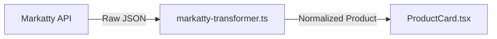

# Product Card — Price & Special Price Display

How the product card resolves and renders **price**, **special price**, and **discount** from the Markatty backend.

---

## Backend → Frontend Data Flow



### 1. Raw Markatty API Fields

| API Field              | Type     | Description                        |
|------------------------|----------|------------------------------------|
| `price`                | `number` | Original (full) price              |
| `specialPrice`         | `number` | Discounted price (0 if no sale)    |
| `finalPrice`           | `number` | Final price after all adjustments  |
| `formatedSpecialPrice` | `string` | Formatted special price with currency (empty string = no discount) |
| `formattedPrice`       | `string` | Formatted original price           |
| `formattedFinalPrice`  | `string` | Formatted final price              |

### 2. Transformer Logic (`lib/markatty-transformer.ts`)

```typescript
const hasDiscount = product.formatedSpecialPrice && product.formatedSpecialPrice !== '';
const displayPrice = hasDiscount ? product.specialPrice : product.finalPrice;
const originalPrice = hasDiscount ? product.price : null;
```

**Discount detection:** A product has a discount when `formatedSpecialPrice` is a non-empty string.

| Condition         | `price` (displayed) | `original_price` | `discount_percent` |
|--------------------|---------------------|--------------------|----------------------|
| Has special price  | `specialPrice`      | `price`            | `round((price - specialPrice) / price × 100)` |
| No special price   | `finalPrice`        | `null`             | `0` |

#### Transformed Output Fields

```json
{
  "id": 123,
  "product_id": 123,
  "price": 599,
  "original_price": 749,
  "special_price": 599,
  "formatted_price": "599.00 SAR",
  "formatted_original_price": "749.00 SAR",
  "discount_percent": 20
}
```

---

## Product Card Display

### Balmy Theme (`components/ProductCard.tsx`)

```typescript
const price    = initialPrice    ?? Number(product?.price) ?? 749;
const oldPrice = initialOldPrice ?? (product?.original_price || product?.price_regular?.value)
                 ?? (price > 0 ? price * 1.3 : 480);
const discount = initialDiscount ?? product?.discount_percent
                 ?? (oldPrice > price ? Math.round(((oldPrice - price) / oldPrice) * 100) : 0);
```

**Rendering:**

| Element           | Shows When                    | Style                              |
|--------------------|-------------------------------|------------------------------------|
| Current price      | Always                        | Bold, large, dark text + SAR icon  |
| Old (original) price | `oldPrice` is truthy         | Small, gray, ~~strikethrough~~ + SAR icon |
| Discount badge     | `discount` > 0                | Red pill badge, e.g. `20%-`        |

### Original Theme (`components/product-card.tsx`)

```typescript
const productPrice = calculateProductPrice(product);
```

`calculateProductPrice` picks:
1. Cheapest variant `special_price` or `price` if variants exist
2. `product.price` as base fallback
3. `0` as ultimate fallback

> **Note:** The original theme only shows one price line — no strikethrough or discount badge.

---

## Summary

```
Markatty API
  │
  ├─ formatedSpecialPrice !== '' → discount exists
  │   ├─ display price     = specialPrice
  │   ├─ original price    = price
  │   └─ discount_percent  = calculated
  │
  └─ formatedSpecialPrice === '' → no discount
      ├─ display price     = finalPrice
      ├─ original price    = null
      └─ discount_percent  = 0
```
